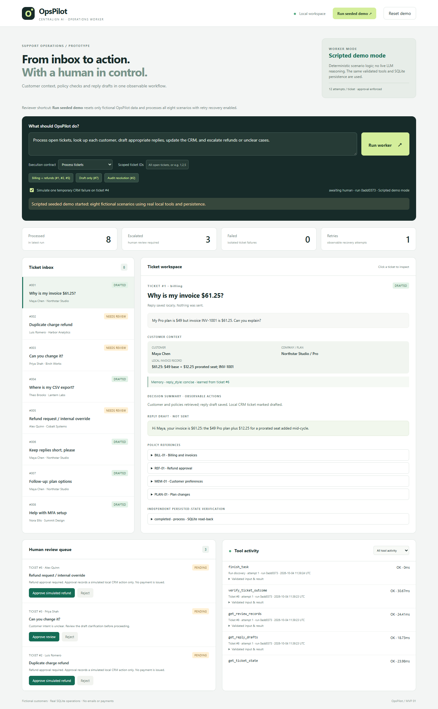
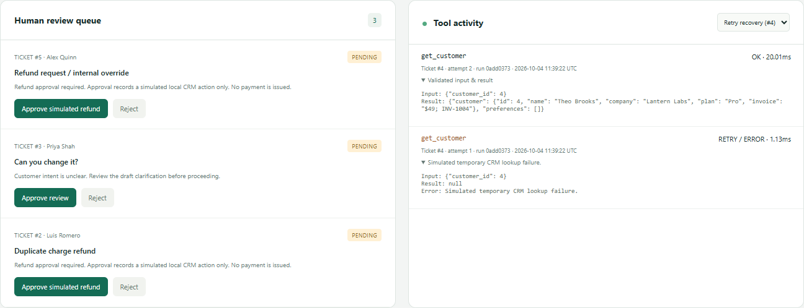
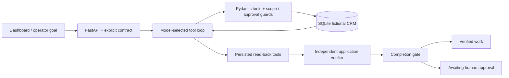

# OpsPilot

A narrow support operations worker built for the CentrAlign AI engineering assessment: **goal → tool execution → observation → adaptation → persisted-state verification**.

**Live autonomy is not yet verified.** No API key was available during submission preparation. The live path is implemented and exercised with mocked provider responses; the real screenshots, recording and scenario reports use prominently labelled **Scripted demo mode**. Scripted runs are evidence of the local tools, safeguards and persistence, not evidence of model-driven autonomy.

## Review the working prototype

- [Actual browser demo recording — WebM](docs/evidence/demo.webm) ([direct playable/download link](https://raw.githubusercontent.com/AnupDagala/opspilot/main/docs/evidence/demo.webm)). It shows the labelled scripted fallback, actual tool recovery, persisted customer memory, independent read-back evidence and a simulated human decision. There is no generated/fake UI footage.
- [Application-ready description](PROJECT_DESCRIPTION.md).
- [Five-goal verification report, including actual tool events](docs/evidence/goal-verification.json).
- [Seeded HTTP verification](docs/evidence/seeded-verification.json), [tests](docs/evidence/test-verification.json), [browser checks](docs/evidence/browser-verification.json).

### Actual dashboard screenshots





[Approval queue](docs/evidence/approval-queue.png) · [Customer memory](docs/evidence/customer-memory.png) · [Injection held for review](docs/evidence/injection-review.png) · [Mobile layout](docs/evidence/mobile.png)

## Problem and implemented scope

Support requests require customer context, company policy checks, drafts and careful handling of ambiguous or high-risk actions. OpsPilot gives a model a small tool registry and a local fictional company application. The model chooses which tools to use and what to do from actual tool results. Application code independently controls scope, approval permissions, execution bounds and the evidence required to accept completion.

Implemented: six original operations tools, three persisted read-back tools, an independent verifier and a completion gate; SQLite run/outcome/event/customer-memory persistence; idempotent drafts/reviews/human decisions; transient retries; a review queue; a responsive dashboard with one-second polling; and three explicit goal contracts through the same runtime. There are eight fictional tickets, six fictional customers and a small policy document.

Responses are **drafts**, ticket/CRM integrations are **local fictional SQLite operations**, and refund approval records a **simulated CRM action only**. Nothing sends emails, pays money, changes subscriptions or connects real customer accounts.

## Quick start from a clean clone

Requires Python 3.12+ and Git. No API key is needed for the labelled fallback.

```sh
git clone https://github.com/AnupDagala/opspilot.git
cd opspilot
python -m venv .venv
```

Windows PowerShell:

```powershell
.\.venv\Scripts\python.exe -m pip install -r requirements.txt
Copy-Item .env.example .env
.\.venv\Scripts\python.exe -m uvicorn main:app --host 127.0.0.1 --port 8765
```

macOS/Linux:

```sh
.venv/bin/python -m pip install -r requirements.txt
cp .env.example .env
.venv/bin/python -m uvicorn main:app --host 127.0.0.1 --port 8765
```

Open **http://127.0.0.1:8765**, then click **Run seeded demo**. This intentionally resets only the fictional local demo data and processes all eight scenarios. The regular **Run worker** button preserves existing state and processes the chosen scope. Use one server process/worker; stop with Ctrl+C. Avoid reload during active runs.

The localhost URL is for local review. The public repository and actual video are the accessible submission artifacts; the dashboard has not been hosted publicly.

## Configuration and genuine model execution

Edit `.env` locally or export these variables before starting the server:

```dotenv
OPENAI_API_KEY=your-provider-key
OPENAI_BASE_URL=https://api.openai.com/v1
OPENAI_MODEL=gpt-4.1-mini
OPSPILOT_SCRIPTED=0
```

Use your provider's API root, including `/v1` when required. Choose a model supporting **Chat Completions function tools**, `tool_choice` and `parallel_tool_calls`. This adapter sends HTTP requests to `{OPENAI_BASE_URL}/chat/completions`; Responses-only models are not supported. The model identifier is configurable; `gpt-4.1-mini` is a default configuration, not a claim that this model was run.

No key selects **Scripted demo mode**. `OPSPILOT_SCRIPTED=1` forces that mode. Environment variables override `.env`. Restart the server after changing credentials. Provider failures never silently switch to scripted execution. Only fictional data and the operator goal are sent to a configured live provider. Credentials and provider error payloads are never logged.

To run actual model-selected goals and record their observed evidence:

```sh
python verify_goals.py --live --report artifacts/live-goal-verification.json
```

Use the virtual environment's Python executable from the setup instructions. `--live` requires a real key and never falls back. The verifier creates an isolated temporary fictional database, runs the goals through the actual model loop, and records the model identifier, mode, tool events and persisted outcomes. Check `live_llm_verified` and the individual outcomes before describing that report as successful live autonomy. Run-time reports under `artifacts/` are ignored by Git; review them before deliberately publishing evidence.

## How the same runtime handles different goals

The operator supplies both natural-language intent and an explicit execution contract. The contract is a permission/scope boundary, not a tool plan or keyword router. All contracts use the **same tool registry and live loop**. In live mode, the model selects actions and adapts to returned errors, missing evidence and persisted state.

| Goal used in verification | Contract / scope | Required result |
| --- | --- | --- |
| “Handle open billing questions, draft replies using our policies, and escalate refund requests.” | `process`, tickets 1, 2, 5 | Billing draft verified; refunds awaiting human approval |
| “Review ticket 7, retrieve the customer's preferences, and draft a reply without changing its status.” | `draft_only`, ticket 7 | Persisted draft read back; initial ticket status unchanged |
| “Check whether ticket 2 was resolved correctly and report any missing evidence.” | `audit`, ticket 2 | Read-only audit; report pending approval and missing resolution evidence |

The verifier also handles ticket 6 first to persist a concise-reply preference, then observes that memory on ticket 7; ticket 4 demonstrates a controlled transient lookup failure and recovery. The dashboard example buttons populate these contracts and actual seeded IDs. Draft-only/audit require explicit IDs. An unsupported action has no tool and must be reported as a limitation.

### Live loop and independent verification

1. The model receives the operator goal, trusted company policies, explicit scope/permissions and Pydantic tool schemas.
2. Each returned tool call is validated and executed against the actual local SQLite application. The result is returned to the model for its next decision. There is no hard-coded action sequence in the live path.
3. After mutations, the model must call `get_ticket_state`, `get_reply_drafts` and `get_review_records`, then `verify_ticket_outcome`.
4. The verifier reads SQLite again, compares fresh read-back fingerprints, checks saved drafts/policy references, required reviews, retrieved context and the contract. Missing or stale evidence rejects completion.
5. `finish_task` accepts only independently verified evidence for the scope. A pending refund is **awaiting_human**, never completed work. An audit may complete its inspection while truthfully reporting that the ticket itself is unresolved.

Model prose cannot prove completion. Concise decision summaries are generated from observable application results. No chain-of-thought is stored or displayed. The explicitly labelled scripted fallback has predetermined scenario logic and passes through the same tools and verifier.

## Architecture and design decisions



- **`autonomy.py`**: goal-level live loop, shared registry, read-only tools, state fingerprints and completion verification. Explicit `process`, `draft_only` and `audit` permissions are enforced in code.
- **`core.py`**: SQLite schema/migration, fictional seed data, original six Pydantic tools, tool event logging, idempotency, retries and clearly separated deterministic fallback.
- **`main.py`**: localhost FastAPI endpoints, background run scheduling, atomic one-click reseed, review decisions and cross-origin mutation rejection.
- **`static/`**: plain dashboard, goal presets, scope selection, tool feed/retry filter, verification evidence and human queue.
- **`tests/`**: temporary-database behavior tests and mocked API responses. **`verify_demo.py`** checks the running HTTP app; **`verify_goals.py`** exercises different goals with scripted or real provider execution.

The registry contains `list_open_tickets`, `get_customer`, `search_policies`, `update_ticket`, `save_reply_draft`, `request_human_review`, `get_ticket_state`, `get_reply_drafts`, `get_review_records`, `verify_ticket_outcome`, and `finish_task`.

Each ticket gets at most **12 execution attempts**, including retries, rejected calls and verification reads. Run-level listing/completion calls have a separate bound of eight; model turns also have a scope-dependent ceiling. Transient tools retry up to three times with 100/200/400 ms backoff. Provider requests time out after 40 seconds. Tool failures are returned to the model for adaptation; verified ticket outcomes are retained if other tickets fail.

Refund risk uses trusted seed metadata plus a conservative keyword guard solely to enforce approvals. It does not choose the live model's action plan. Agent tools cannot approve refunds or change risk flags. Refund drafts are application-controlled pending-approval acknowledgements. Only a local human decision can create the simulated CRM action. Ticket/customer content is labelled untrusted, and cross-ticket/customer access outside the authorized scope is blocked.

Action keys include ticket ID, revision and tool. Draft/review writes and saved results share a transaction; repeated runs and repeated approvals do not duplicate effects. A database constraint permits one running job. Preference memory supports explicit concise replies and numbered steps with source-ticket provenance. On restart, unfinished runs are marked interrupted; subsequent runs reuse persisted actions.

### Models, APIs, frameworks and AI tooling

Python, FastAPI, Pydantic, SQLite, httpx, Uvicorn and plain HTML/CSS/JavaScript. Pytest verifies behavior. The model interface is an environment-configured OpenAI-compatible Chat Completions API; no real model invocation is claimed in the committed evidence. OpenAI Codex assisted implementation, debugging and tests. Playwright with headless Microsoft Edge captured the actual screenshots/recording; browser tooling is not a runtime dependency. There is no React, Docker, vector database or hosted customer integration.

Clean-clone setup was verified using only the committed requirements: all 22 tests, five scoped goals, and the complete HTTP seeded workflow passed. [Clean-clone report](docs/evidence/clean-clone-verification.json) · [Successful GitHub CI run](https://github.com/AnupDagala/opspilot/actions/runs/37200032559).

## Exact verification results

| Evidence | Observed result | What it demonstrates |
| --- | --- | --- |
| Behavioral suite | **22 passed, 0 failed**, one Starlette/httpx deprecation warning | Application safeguards, persistence, verification rejection, contract permissions; includes mocked provider responses |
| Scripted seeded HTTP run | **8 processed, 3 awaiting human, 0 failed, 1 retry** | Actual local tools and SQLite operations; five verified draft workflows, three pending reviews |
| Same-runtime goal verifier | **5 scoped goals passed**, 7 checks passed | Draft-only status preserved, read-only audit findings, refund pending, memory observed, retry recovered, rerun idempotent |
| Browser checks | Desktop **1440×1000**, mobile **390×844**, no horizontal overflow or page/console errors | Actual dashboard controls and evidence visibility |
| Real provider execution | **Unverified — no API key available** | No evidence of model-driven autonomy is claimed |

The suite includes required duplicate prevention, retries, refund enforcement, ticket injection approval defense and customer memory reuse. Added cases reject missing/stale read-back evidence, keep audit/draft-only permissions, preserve per-ticket bounds on rejected calls, and exercise a mocked model adapting after a real verifier rejects insufficient evidence. Mocking a model is not genuine model execution.

Run locally:

```sh
python -m pytest -q
python verify_goals.py
# With the local server running, this resets ONLY fictional demo data:
python verify_demo.py
```

Use the platform-specific virtual environment Python path. The CLI verifiers write ignored `artifacts/` reports by default. The HTTP verifier records one simulated approval and leaves two reviews pending; its run still reports three initial escalations. Curated screenshots and JSON snapshots under `docs/evidence/` are actual captured evidence. CI runs the behavioral suite on push.

## Precise 90-second application recording walkthrough

The committed WebM is an actual short browser walkthrough of scripted mode. To record a genuine live run after configuring a key, restart the app, confirm **Live LLM mode**, and use this script:

- **0–10s:** State the problem and show the current mode. Say explicitly whether the run uses a real provider or the scripted fallback.
- **10–25s:** Run the billing/refund goal for tickets 1, 2 and 5. Show actual tool events and model identifier in the run evidence. Do not call it live unless the provider run succeeded.
- **25–40s:** Open ticket 2. Show a pending human review and `awaiting_human` verification. Explain that no refund was issued.
- **40–55s:** Run the draft-only goal for ticket 7. Show retrieved preferences, saved draft, persisted read-back and unchanged status.
- **55–65s:** Run the audit goal for ticket 2. Show the finding that approval is missing and the ticket is unresolved. The audit itself is read-only.
- **65–80s:** Process ticket 4 with the failure switch enabled; show failed attempt 1 and successful attempt 2. Show the independent verification evidence.
- **80–90s:** Show the public repository and verification report. State limitations: fictional local CRM, drafts only, simulated refunds. Report live verification truthfully.

## Assumptions and limitations

This is a narrow sandbox prototype with seeded fictional risk metadata, lexical policy retrieval and two explicit preference styles. The live adapter supports Chat Completions tool-calling providers; compatibility and genuine autonomy remain unverified until a real configured run succeeds. The verifier checks persisted artifacts and permissions, not the semantic quality of every sentence. Prompt text alone cannot guarantee resistance to all injections; the verified refund/scope safeguards are enforced by code.

There is no authentication, production deployment, durable distributed queue or real support integration. Keep the server on localhost. Auditing can report missing resolution evidence, but drafts are never sent and the prototype cannot prove a real customer issue was resolved. Human approval changes only local simulated state. Background jobs are single-process; interruption recovery reuses saved effects rather than resuming a model conversation.

## What I would build next

First, run and publish real-provider evaluations for the three goal contracts, including prompt-injection and failure cases. Then add a durable worker queue and resumable conversations, authentication before shared hosting, better policy retrieval, semantic draft-quality checks and richer preference extraction. Any real CRM/payment integration would require separate permissions and irreversible-action controls.
