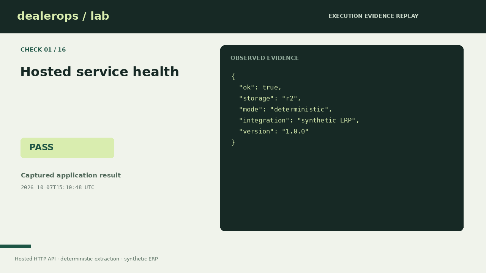

# DealerOps Lab

An independent dealer-order automation companion to OpsPilot, built by **Anup Dagala** for the workflows described in Zunderdog's AI & Automation Developer opening. This is not affiliated with Zunderdog, does not connect to ZunderFlow and makes no claim that its advertised features are missing.

**Live hosted demo:** https://dealerops-lab-anup.anup-dagala.chatgpt.site

The demo is public. Each visitor gets an isolated synthetic sandbox; no hosting sign-in is needed.

**Source:** [OpsPilot companion](https://github.com/AnupDagala/opspilot/tree/main/examples/dealerops). The public demo also includes a [complete source ZIP](https://dealerops-lab-anup.anup-dagala.chatgpt.site/downloads/dealerops-source.zip).

- [92-second execution evidence replay](evidence/execution-walkthrough.mp4) · [Hosted MP4](https://dealerops-lab-anup.anup-dagala.chatgpt.site/downloads/execution-walkthrough.mp4)
- [Hosted API evidence](evidence/hosted-api-verification.json)
- [60-case extraction evaluation](evidence/evaluation.json)
- [Behavioural test output](evidence/tests.tap)
- [Requirements and verification limits](docs/requirements.md)
- [Interview walkthrough and tradeoffs](docs/engineering-brief.md)
- [Integration setup](docs/integrations.md)



## What works

The hosted JavaScript Worker accepts synthetic portal/email/WhatsApp-shaped order requests. It clarifies missing SKU, quantity or delivery, enforces fictional catalogue pricing, stock and credit, requires a separate reviewer credential, invalidates approvals after edits and atomically saves inventory, credit and a synthetic ERP receipt in one conditionally written R2 object. An intentionally lost acknowledgement leaves the order pending; reconciliation reads the saved receipt without decrementing stock twice.

Each visitor creates an isolated 24-hour sandbox. Server checks bind requests to its operator/reviewer credentials. Both demo roles are issued to the visitor so the workflow can be demonstrated; **this is not employee authentication or a production authorisation system**. Access expires after 24 hours; automated deletion of expired R2 objects is not implemented. No real customer data should be entered.

**Extraction defaults to a deterministic parser. Live LLM performance, live LangChain execution, Google Sheets and WhatsApp integration are not verified.** Provider failures preserve requests for explicit retry; the live path never silently switches to deterministic extraction. The evidence video is a replay of captured API execution results, not a browser screen recording. Browser visual QA was unavailable in this environment.

## Review in the interface

1. Click **Run three-case demo**. Open the clear, ambiguous and discount requests.
2. On the clear request, click **Test operator approval denial**; the server returns `role_forbidden`.
3. Approve as the simulated reviewer. Change the quantity; the approval is invalidated.
4. Approve the new revision and click **Simulate lost acknowledgement**.
5. Click **Reconcile saved receipt**. The receipt exists, stock was decremented once and the order completes.
6. In **Evidence & integrations**, run the independent live API checks. Download the session audit from **Audit trail**.

## Reproduce without a hosted account

Requires **Node.js 24+** and Python 3.12+ for source packaging. Python client/compile checks use Python 3.12+; optional LangChain execution has separate dependencies.

```sh
git clone https://github.com/AnupDagala/opspilot.git
cd opspilot/examples/dealerops
# Alternatively extract DealerOps_Lab_Source.zip and cd dealerops
node --test tests/core.test.mjs
node scripts/evaluate.mjs
node scripts/validate-workflows.mjs
node scripts/verify-local.mjs
```

The local verifier executes actual Worker `Request` handlers against a file-backed R2 contract emulator. It is **not** a remote HTTP/R2 or browser test. It writes ignored, fictional session state under `artifacts/`. Do not commit that state or any credentials. It regenerates the execution transcript; keep the curated hosted evidence separate when recording.

To check a public deployment:

```sh
node --use-env-proxy scripts/verify-api.mjs https://your-public-host
python3 python/dealerops_client.py --url https://your-public-host
```

The recorded hosted verification has **16 passing checks**. Local core tests have **44 passing tests**, and the deterministic extraction evaluation has **60/60 passing cases**. The [GitHub CI run](https://github.com/AnupDagala/opspilot/actions/runs/37659689525) passed and executed the real n8n verification workflow: intake awaiting approval, duplicate prevention and operator approval denial. The fixture uses the same handlers through a CI HTTP bridge with memory storage; this is n8n runtime evidence, not an external ERP connection. Passing deterministic cases do not establish model quality.

## Project files

| Path | Purpose |
|---|---|
| `worker/core.mjs` | Extraction, business rules, approvals, one-effect commit, R2 conditional updates and API |
| `worker/ui.html` | Accessible responsive workbench, review drawer, audit export and live-check controls |
| `worker/index.js` | Generated deployable ESM bundle; rebuild after changing core or UI |
| `tests/core.test.mjs` | Behaviour, concurrency, scope, boundary and HTTP-handler checks |
| `n8n/*.workflow.json` | Intake, error-handling and runtime verification workflows |
| `python/dealerops_client.py` | Standard-library client for the hosted API |
| `python/langchain_service.py` | Optional authenticated localhost structured-extraction service |
| `python/evaluate_live.py` | Two-prompt real-provider evaluation; refuses to run without credentials |
| `python/sheets_readback.py` | Optional real Sheets inventory read adapter |
| `scripts/record-evidence.py` | Reproducible video from captured execution evidence |

## Deployment

The actual deployment uses a Cloudflare Worker and a provisioned R2 binding called `BUCKET` through Sites. Source is synchronised to the hosting service before an archive is saved and deployed. This repository copy deliberately excludes the account-specific hosting manifest. For a new deployment, register your own Site and declare `r2: "BUCKET"` in its `.openai/hosting.json`. Do not reuse someone else's project ID.

```sh
node scripts/bundle.mjs
# Build after registering your own Site and writing its hosting manifest:
bash scripts/build.sh
node scripts/validate-artifact.mjs
```

No model credential is embedded in the browser. The optional hosted provider uses server runtime secrets `MODEL_API_KEY` and a configured `MODEL_NAME`. Request text is the only business input sent to that provider. Current model mode is visible in `/api/health` and on the dashboard.

## Technical boundaries

One line per order; three fictional SKUs; two fictional dealers; 30 orders per session; bounded messages/events; one conditional R2 write per state mutation. All receipts are synthetic. The loss scenario simulates acknowledgement loss **after the application commit**, not a real third-party ERP network failure. External writes would need a durable outbox, provider-specific idempotency and reconciliation before claiming the same guarantee. This demo does not issue GST invoices, send messages, reserve real stock, move funds or authenticate real staff.

OpenAI Codex assisted implementation and verification. Anup should rehearse the controls and modify the code himself before an interview.
